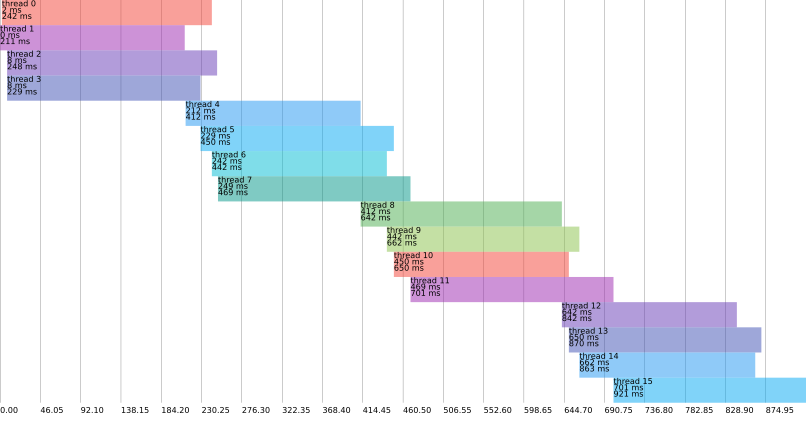

# Thread Tracker

TL;DR: generate thread trace (JSON) from Java

project sibling of <https://github.com/PicoJr/thread-time>



> Thread pool with 4 threads and 16 tasks

## How it Works

0. create a threadTracker

    ``` java
    ThreadTracker threadTracker = new DefaultThreadTracker();
    ```

1. instrument code with:

    ``` java
        long segmentId = threadTracker.createSegment("task", group);
        threadTracker.startSegment(segmentId);
        // some code to time
        threadTracker.endSegment(segmentId);
    ```
    
    NB: segments with the same group are displayed on the same lane.

2. dump to JSON

    ```
    threadTracker.dump(Paths.get("out.json"));
    ```

## Example

see `res/out.json`